

### 📱 실시간 가격 최저가 모니터링 서비스 📱

 

## 💻 기간
2023.8.28 ~ 2023.10.6

## 🙋🏻 참여인원 및 역할

| 이름   | 역할                  |                                         
|  ---  | ------------------- |
| 강민승 | Backend & Data & Team Leader |
| 최영태 | Backend & Data               |
| 이기표 | Backend & Data               |
| 김희웅 | Android                      |
| 김진영 | Android                      |

## 📌 목차
1. [**앱 소개**](#-앱-소개)
1. [**서비스 흐름도**](#-서비스-흐름도)
1. [**기술 스택**](#-기술-스택)
1. [**데이터 구조**](#-데이터-구조)
1. [**시스템 구조도**](#-시스템-구조도)

 

## 📱 앱 소개

기웃기웃은 실시간으로 가격을 감지하여 최저가를 모니터링 하고 사용자들에게 최고의 구매 타이밍을 제공합니다.

 

| 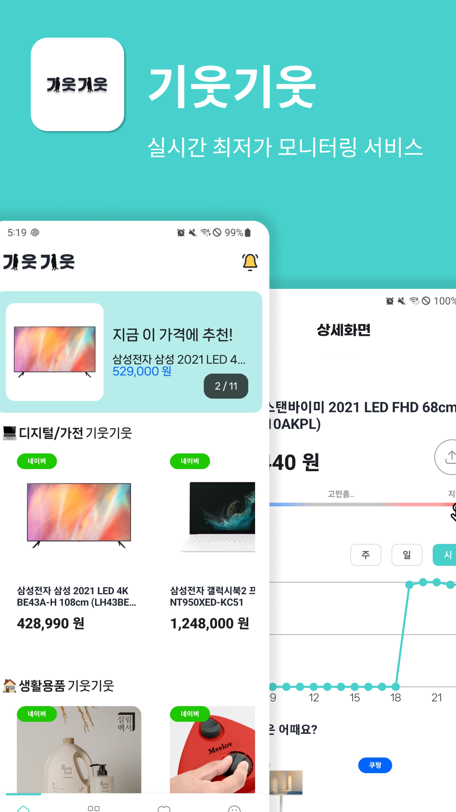{ width="220" } |  |  |
|---|---|---|
| 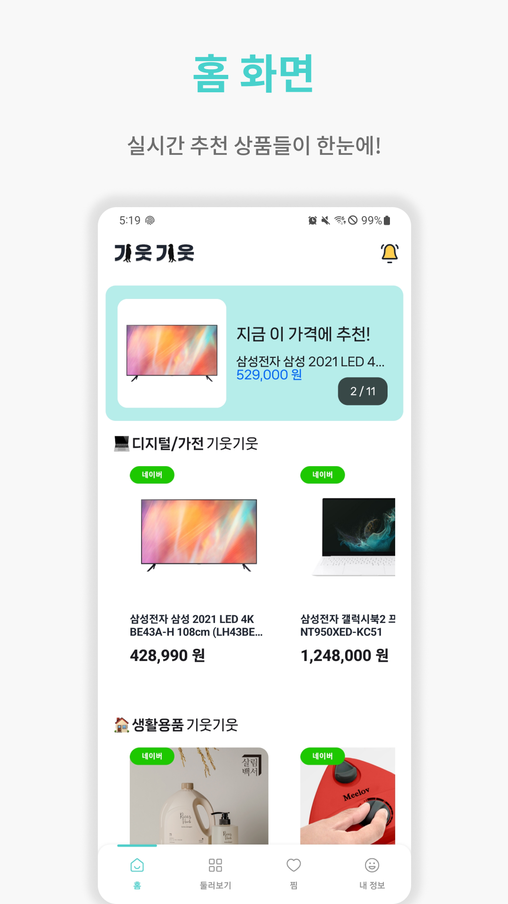{ width="220" } | 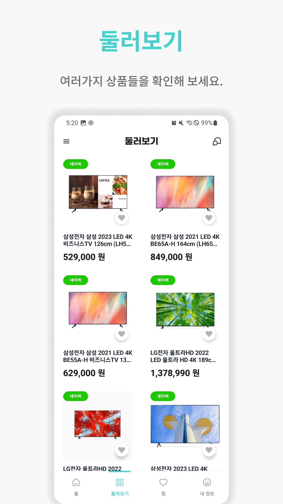{ width="220" } | 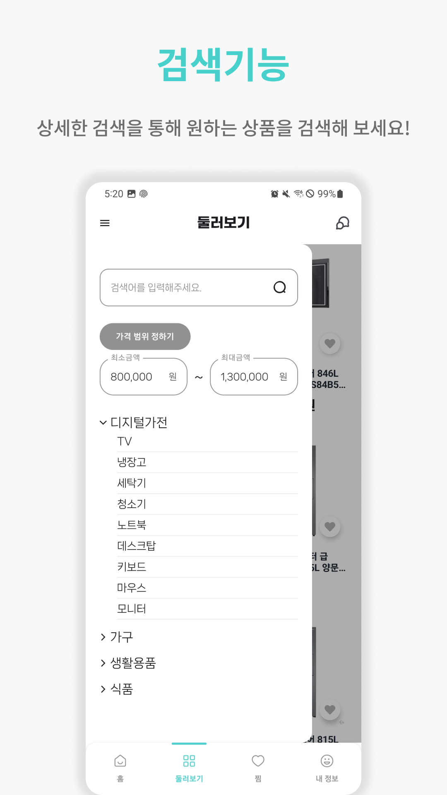{ width="220" } |
| 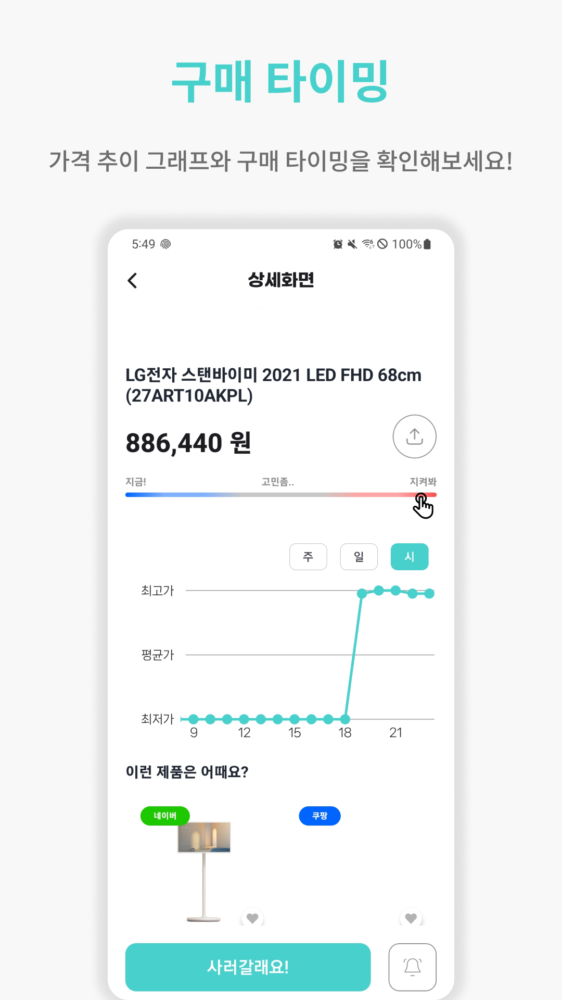{ width="220" } | { width="220" } | 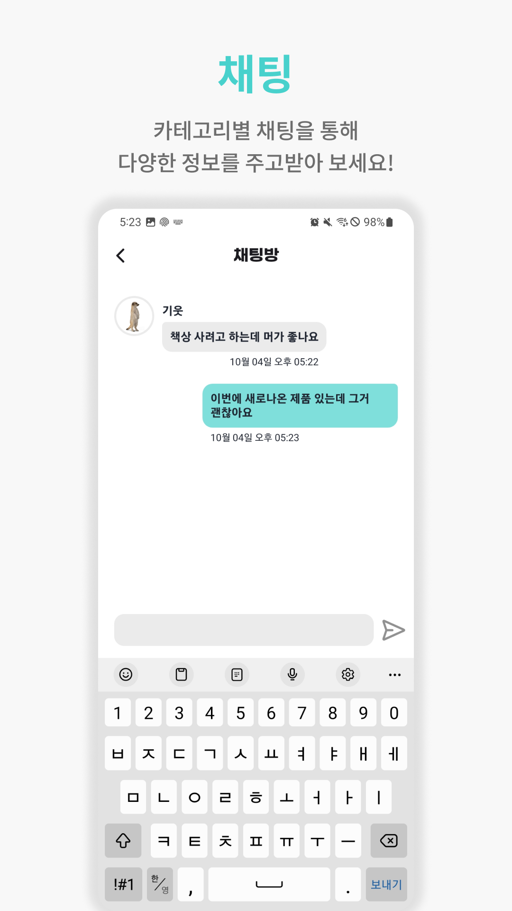{ width="220" } |

 

## 📱 서비스 흐름도
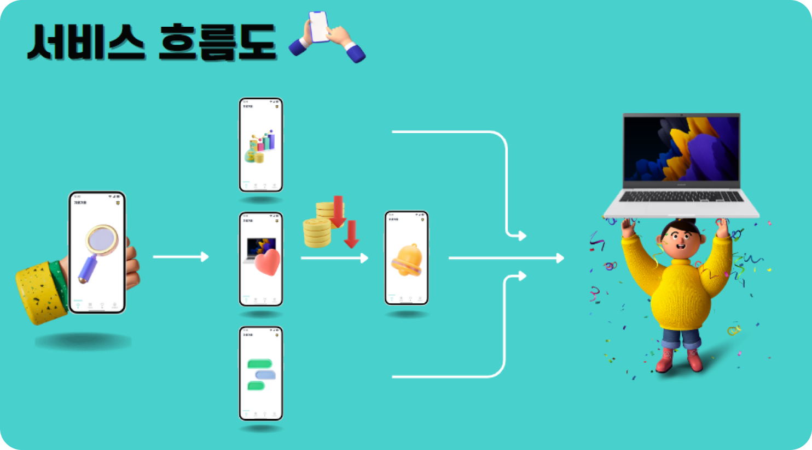{ width="800" }

 

## 📍 기술 스택

### Android

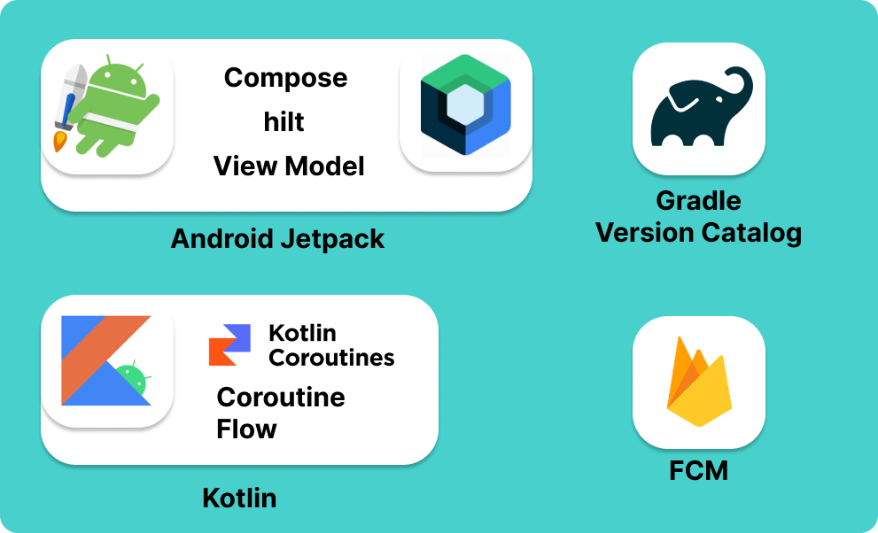{ width="400" }

### Backend

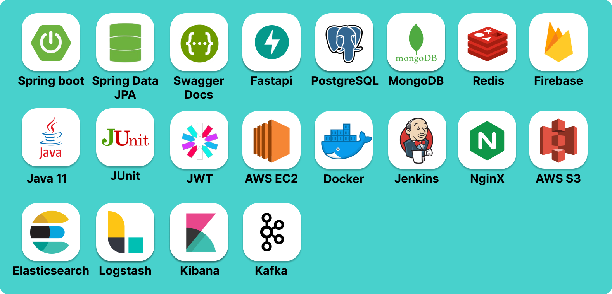{ width="500" }

### Communication

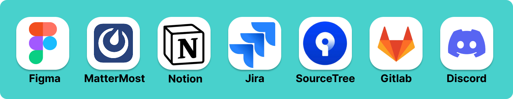{ width="500" }

 

## 📃 데이터 구조

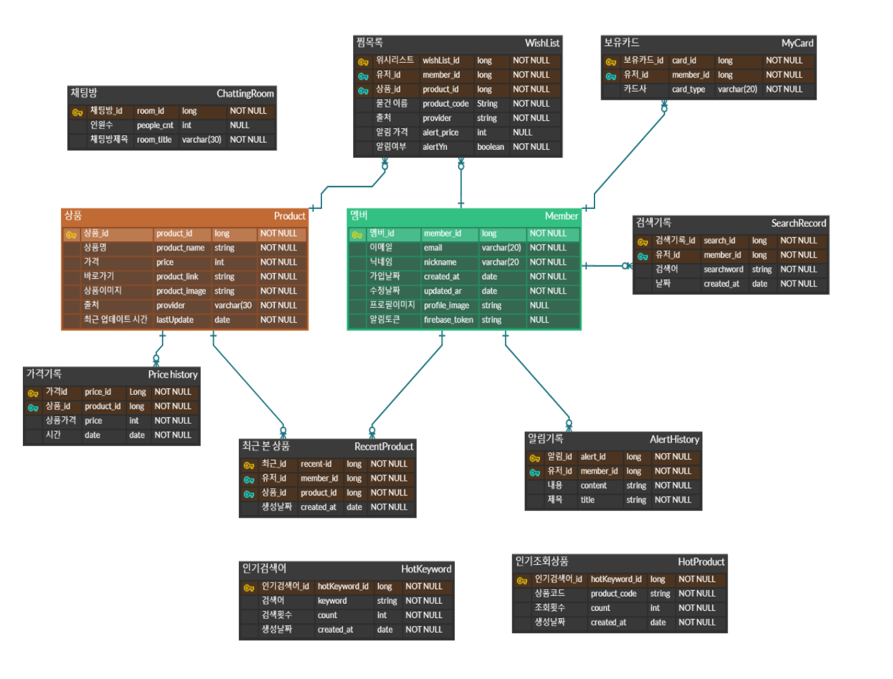{ width="800" }

 

## 🔎 시스템 구조도

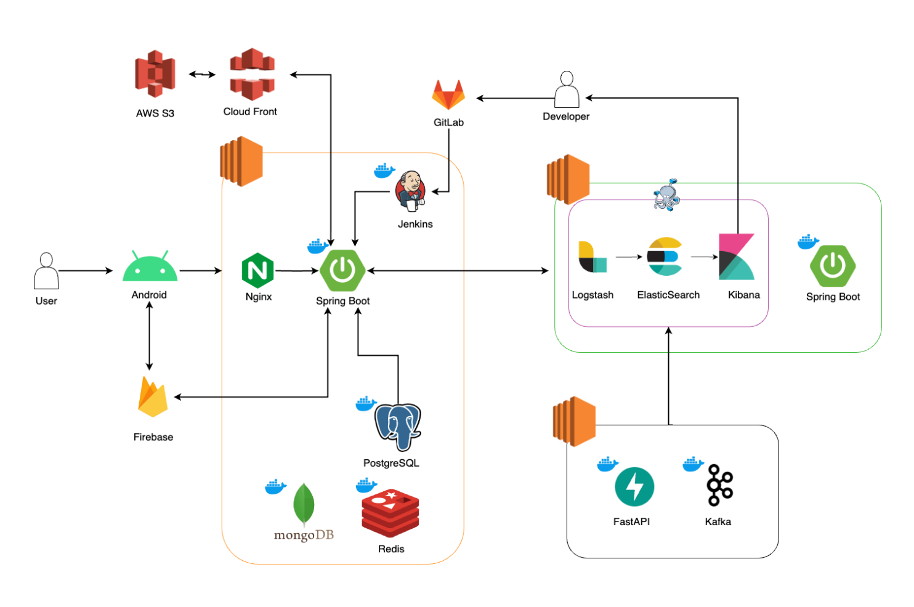{ width="800" }

 

## Git Convention
✨ feat : [commit message] | [name] | [files]

✏ modify : [commit message] | [name] | [files]

🛠 fix : [commit message] | [name] | [files]

📃 docs : [commit message] | [name] | [files]

🎨 style : [commit message] | [name] | [files]

♻ refactor : [commit message] | [name] | [files]

👶 rename : [commit message] | [name] | [files]

💯 test : [commit message] | [name] | [files]

🏗 chore : [commit message] | [name] | [files]

⚙ config : [commit message] | [name] | [files]
