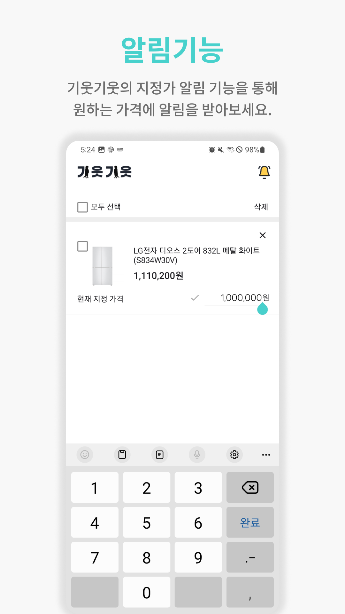

### 📱 실시간 가격 최저가 모니터링 서비스 📱

 

## 💻 기간
2023.8.28 ~ 2023.10.6 (총 6주)

## 🙋🏻 참여인원 및 역할

| 이름   | 역할                  |                                         
|  ---  | ------------------- |
| 강민승 | Backend & Data & Team Leader |
| 최영태 | Backend & Data               |
| 이기표 | Backend & Data               |
| 김희웅 | Android                      |
| 김진영 | Android                      |

## 📌 목차
1. [**앱 소개**](#-앱-소개)
1. [**서비스 흐름도**](#-서비스-흐름도)
1. [**기술 스택**](#-기술-스택)
1. [**데이터 구조**](#-데이터-구조)
1. [**시스템 구조도**](#-시스템-구조도)

 

## 📱 앱 소개

기웃기웃은 실시간으로 가격을 감지하여 최저가를 모니터링 하고 사용자들에게 최고의 구매 타이밍을 제공합니다.

 

| { width="400" }                                                                                                                                                                              |                                                                                                                                                                                                                                                      |
|----------------------------------------------------------------------------------------------------------------------------------------------------------------------------------------------------------------|------------------------------------------------------------------------------------------------------------------------------------------------------------------------------------------------------------------------------------------------------|
| { width="400" }  **홈 화면**   1. 추천 상품 : 찜 상품의 상품명들을 조합하여 추천  2. 카테고리별 인기 상품 : 4가지 대분류별 상위 조회 상품 리스트                                                                                 | { width="400" }  **둘러보기**  1. 카테고리별 상품 둘러보기       2. 검색, 채팅방으로 이동 가능                                                                                                                                                     |
| { width="400" }  **검색**   1. Full-Text Search : Elasticsearch의 Match, Match Prase,  should, Fuzziness 등의 쿼리를 활용하여 검색  2. 가격 필터 : 원하는 가격대를 설정하여 옵션 설정  3. 검색 기록 : 최근 검색어 5개 확인 가능 | { width="400" }       **상세화면**  1. 구매 타이밍 : 최근 한달간의 평균가와 현재가격 비교하여 7단계의 타이밍 제공  2. 가격 그래프 : 주, 일, 시간별 최저가 추이 확인 가능 3. 연관 상품 : 현재 상품과 연관된 상품 리스트  4. 공유하기 : 현재 상품의 링크를 외부에 공유 가능  5. 찜 등록 : 찜 등록과 함께 알림 받을 가격 설정 |
| { width="400" }  **찜 화면**   1. 찜 상품 : 알림 on/off, 지정가 편집  2. 알림기록 : 알림 히스토리 확인 가능                                                                                                   | { width="400" }      **채팅**   1. 채팅방 : 소분류별로 생성된 채팅방을 통해 다른 회원들과 실시간 정보 공유                 2. 하이퍼링크 : 링크 공유를 통해 외부로 이동 가능                                                                                                |

 

## 📱 서비스 흐름도
{ width="800" }

 

## 📍 기술 스택

### Android

{ width="400" }

### Backend

{ width="500" }

### Communication

{ width="500" }

 

## 📃 데이터 구조

{ width="800" }
>상품 및 가격 기록은 Elasticsearch에 저장
 

## 🔗 데이터 파이프라인

{ width="800" }
{ width="800" }
> 1. Kafka broker 3개로 클러스터 구축
> 2. 수집 데이터 Kafka로 전송, 대분류별 topic 분리
> 3. Logstash에서 실시간 감지
> 4. 각 토픽별 데이터를 json 파싱하여 spring으로 전송
> 5. 업데이트 처리 로직 진행
> 6. Elasticsearch에 상품코드 역색인하여 저장

## 🔎 시스템 구조도

{ width="800" }

 

## Git Convention
✨ feat : [commit message] | [name] | [files]

✏ modify : [commit message] | [name] | [files]

🛠 fix : [commit message] | [name] | [files]

📃 docs : [commit message] | [name] | [files]

🎨 style : [commit message] | [name] | [files]

♻ refactor : [commit message] | [name] | [files]

👶 rename : [commit message] | [name] | [files]

💯 test : [commit message] | [name] | [files]

🏗 chore : [commit message] | [name] | [files]

⚙ config : [commit message] | [name] | [files]
