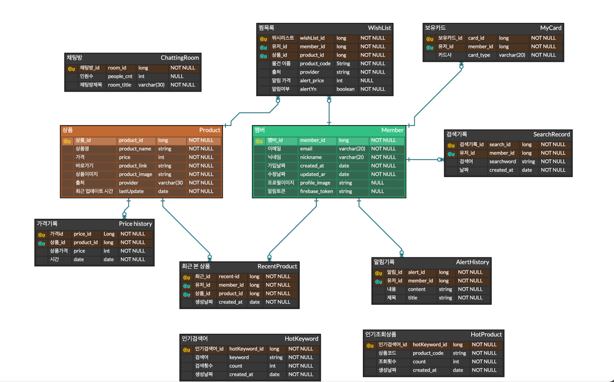
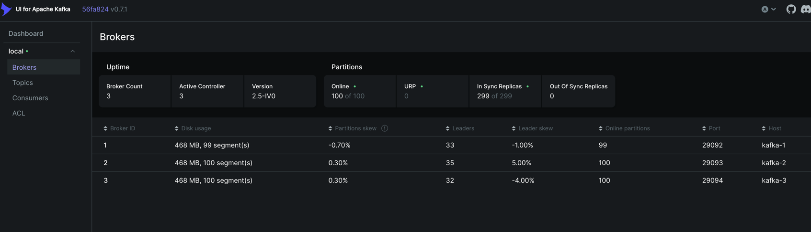
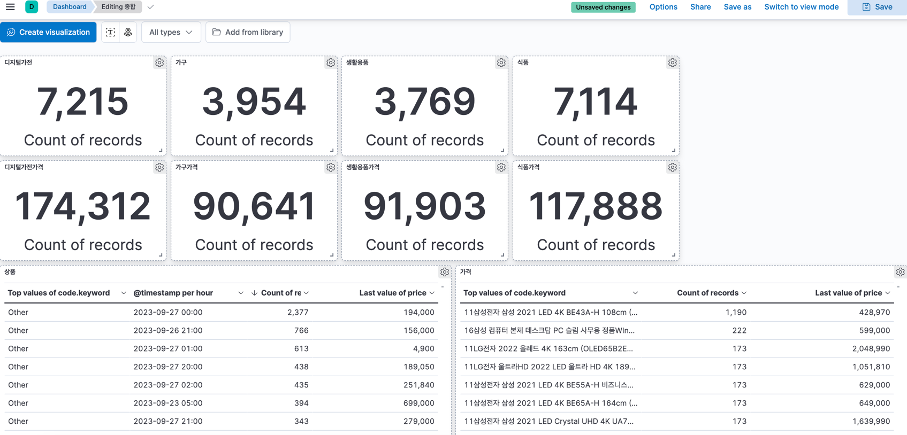
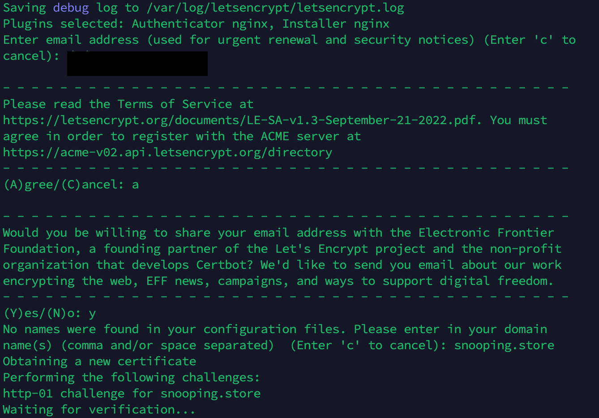
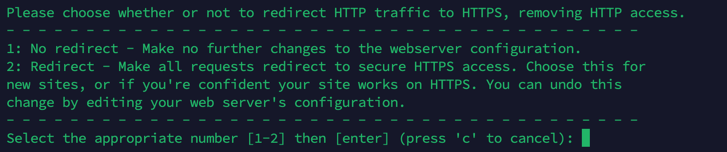
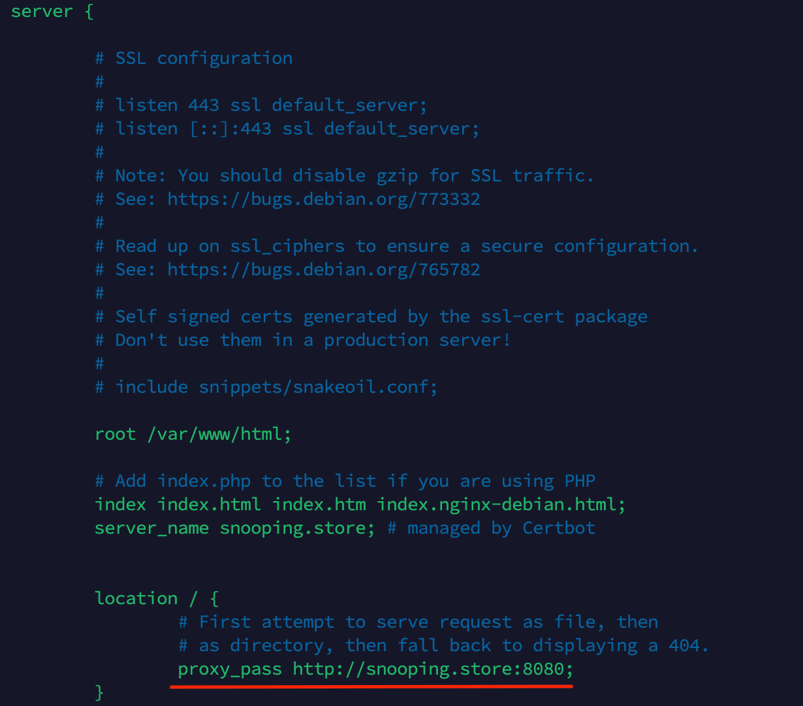

# 📜Porting Manual


## 📝목차
1) [시스템 환경 및 버전정보](#1-시스템-환경-및-버전정보)
2) [포트 정보](#2-포트-정보)
3) [서버 접속](#3-서버-접속)
4) [빌드 및 배포](#4-빌드-및-배포)
5) [DB](#5-DB)
6) [Kafka](#6-Kafka)
7) [ELK](#7-ELK)
8) [CI/CD](#8-CI/CD)
9) [NGINX](#9-NGINX)
10) [APK](#10-APK)


## 1. ⚙시스템 환경 및 버전정보

- JVM : JDK 11
- Android IDE : Android Studio 2022.2.1 Patch2
- Backend IDE : Intellij Ultimate 2023.1.3
- Framework : SpringBoot 2.7.13
- Android : Android-gradle-plugin 7.4.1, Kotlin 1.8.0
- Server : AWS EC2 instance - ubuntu 20.04
- WAS : NGINX 1.18.0
- DB : PostgresSQL 16.0.0, MongoDB 6.0, Redis 7.0
- Data : zookeeper 5.5.1, kafka 5.5.1
- ELK : Logstash 7.14.0, Elasticsearch 7.14.0, Kibana 7.14.0

<br>

## 2. 🔌포트 정보

| Port  | 이름                       |
|:------|:-------------------------|
| 8080  | HTTP => 80(HTTPS)로 리다이렉트 |
| 80    | HTTPS                    |
| 5432  | PostgresSQL              |
| 8080  | SpringBoot               |
| 9090  | Jenkins                  |
| 6379  | Redis                    |
| 27017 | MongoDB                  |
| 9092  | Kafka                    |
| 2181  | zookeeper                |
| 5044  | Logstash                 |
| 9200  | Elasticsearch            |
| 5601  | Kibana                   |

<br>

## 3. 💻 서버 접속

> SSH로 EC2 접속

### 3.1. 포트 개방
```bash
$ sudo ufw allow {portnumber}
$ sudo ufw numbered # 포트 개방 확인
```

### 3.2. JDK 설치
```bash
# JDK 11 설치
$ sudo apt-get install openjdk-11-jre-headless

# 설치 확인
$ java -version
```

### 3.3. 🐳 도커 설치 후 실행
```bash
$ sudo apt update
$ sudo apt-get install docker-ce docker-ce-cli containerd.io
$ sudo systemctl start docker
```

### 3.4. 🗄️ 컨테이너 실행
```bash

# postgreSQL
$ docker run -p 5432:5432 --name postgres -e POSTGRES_PASSWORD= -e TZ=Asia/Seoul -v /home/ubuntu/postgre:/var/lib/postgresql/data -d postgres:latest

# redis
$ docker run -p 6379:6379 --name redis -v /home/ubuntu/redis:/data -d redis:latest

# mongoDB
$ docker run -d -p 27017:27017 --name my-mongodb   -e MONGO_INITDB_ROOT_USERNAME=  -e MONGO_INITDB_ROOT_PASSWORD=  mongo:latest

# 젠킨스
$ docker run \
--name jenkins \
-d \
-p 9090:8080 \
-p 50000:50000 \
-v /home/ubuntu/jenkins:/var/jenkins_home \
-v /var/run/docker.sock:/var/run/docker.sock \
-u root \
-d jenkins/jenkins:lts
```

<br>

## 4. 🚀 빌드 및 배포

### 4.1. Dockerfile 작성

```dockerfile
# Dockerfile
FROM adoptopenjdk/openjdk11
LABEL authors="D104"
ARG JAR_FILE=build/libs/*.jar
COPY ${JAR_FILE} app.jar
ENTRYPOINT ["java","-jar","/app.jar"]
```

### 4.2. Jar 파일 빌드
```bash
$ ./gradlew bootJar
```

### 4.3. 로컬에서 도커 이미지 빌드 및 푸시
```bash
docker build -t {사용자명}/{이미지파일명} .
docker push {사용자명}/{이미지파일명}
```

### 4.4. EC2에서 도커 이미지 풀 및 컨테이너 실행
```bash
sudo docker pull {사용자명}/{이미지파일명}
sudo docker run -d --name spring -e "JASYPT_ENCRYPTOR_PASSWORD=daffdsfewjfiawbvkjqwuehwqilddsajklhrewrk1mn123125dfdaskjlrhewknmbvnmcvbrawe"
 -p 8080:8080 {사용자명}/{이미지파일명}
 # (Jasypt 암호화 키를 환경변수에 추가하여 실행)
```

<br>

## 5. 🗃️DB

### 5.1. properties
- application.yml

### 5.2. PostgresSQL
> DBeaver - postgres<br>
> Hostname : , port : 5432<br>
> Username : admin, Password :


### 5.3. Mongo-express

```bash
docker run --name mongo-express -d \
-e ME_CONFIG_MONGODB_SERVER={ip주소} \
-e ME_CONFIG_MONGODB_PORT=27017 \
-e ME_CONFIG_MONGODB_ADMINUSERNAME= \
-e ME_CONFIG_MONGODB_ADMINPASSWORD= \
-e ME_CONFIG_MONGODB_AUTH_DATABASE= \
-p 8081:8081 mongo-express
```
8081 포트로 접속

### 5.4. 덤프 파일 최신본
- /exec/snoop-dump.zip

### 5.5. ERD
[ERDCloud](https://www.erdcloud.com/d/5maEGH8PWxKb4EEqm)

<br>

## 6. Kafka

- kafka 클러스터 컴포즈 파일
- 3개의 브로커로 구성

```dockerfile
---
version: '3.8'
services:
  zookeeper-1:
    image: confluentinc/cp-zookeeper:5.5.1
    environment:
      ZOOKEEPER_CLIENT_PORT: 2181
      ZOOKEEPER_TICK_TIME: 2000
    volumes:
      - /var/lib/zookeeper/data:/var/lib/zookeeper/data
      - /var/lib/zookeeper/log:/var/lib/zookeeper/log


  kafka-1:
    image: confluentinc/cp-kafka:5.5.1
    ports:
      - '9092:9092'
    extra_hosts:
      - "localhost:0.0.0.0"
    depends_on:
      - zookeeper-1
    environment:
      KAFKA_BROKER_ID: 1
      KAFKA_ZOOKEEPER_CONNECT: zookeeper-1:2181
      KAFKA_LISTENER_SECURITY_PROTOCOL_MAP: INTERNAL:PLAINTEXT,EXTERNAL:PLAINTEXT
      KAFKA_INTER_BROKER_LISTENER_NAME: INTERNAL
      KAFKA_ADVERTISED_LISTENERS: INTERNAL://kafka-1:29092,EXTERNAL://{ip주소}:9092
      KAFKA_DEFAULT_REPLICATION_FACTOR: 3
      KAFKA_NUM_PARTITIONS: 3

  kafka-2:
    image: confluentinc/cp-kafka:5.5.1
    ports:
      - '9093:9093'
    extra_hosts:
      - "localhost:0.0.0.0"
    depends_on:
      - zookeeper-1
    environment:
      KAFKA_BROKER_ID: 2
      KAFKA_ZOOKEEPER_CONNECT: zookeeper-1:2181
      KAFKA_LISTENER_SECURITY_PROTOCOL_MAP: INTERNAL:PLAINTEXT,EXTERNAL:PLAINTEXT
      KAFKA_INTER_BROKER_LISTENER_NAME: INTERNAL
      KAFKA_ADVERTISED_LISTENERS: INTERNAL://kafka-2:29093,EXTERNAL://{ip주소}:9093
      KAFKA_DEFAULT_REPLICATION_FACTOR: 3
      KAFKA_NUM_PARTITIONS: 3


  kafka-3:
    image: confluentinc/cp-kafka:5.5.1
    ports:
      - '9094:9094'
    extra_hosts:
      - "localhost:0.0.0.0"
    depends_on:
      - zookeeper-1
    environment:
      KAFKA_BROKER_ID: 3
      KAFKA_ZOOKEEPER_CONNECT: zookeeper-1:2181
      KAFKA_LISTENER_SECURITY_PROTOCOL_MAP: INTERNAL:PLAINTEXT,EXTERNAL:PLAINTEXT
      KAFKA_INTER_BROKER_LISTENER_NAME: INTERNAL
      KAFKA_ADVERTISED_LISTENERS: INTERNAL://kafka-3:29094,EXTERNAL://{ip주소}:9094
      KAFKA_DEFAULT_REPLICATION_FACTOR: 3
      KAFKA_NUM_PARTITIONS: 3

```

- 모니터링을 위한 kafka-ui
```dockerfile
version: '3'
services:
  kafka-ui:
    image: provectuslabs/kafka-ui
    container_name: kafka-ui
    ports:
      - "8989:8080"
    restart: always
    environment:
      - KAFKA_CLUSTERS_0_NAME=local
      - KAFKA_CLUSTERS_0_BOOTSTRAPSERVERS=kafka-1:29092,kafka-2:29093,kafka-3:29094
      - KAFKA_CLUSTERS_0_ZOOKEEPER=zookeeper-1:22181
```

8989 포트로 접속

## 7. ELK

- ELK 스택 구출을 위한 컴포즈 파일
- elasticsearch : 마스터 노드 1개, 슬레이브 노드 2개
- logstash : 각 토픽별 한개씩 4개

```dockerfile
version: '3'
services:
  elasticsearch:
    image: custom-elasticsearch:7.14.0
    environment:
      - cluster.name=docker-cluster
      - node.name=elasticsearch
      - discovery.seed_hosts=elasticsearch2,elasticsearch3
      - cluster.initial_master_nodes=elasticsearch,elasticsearch2,elasticsearch3
      - "ES_JAVA_OPTS=-Xms1g -Xmx1g"
    ports:
      - "9200:9200"
    networks:
      - esnet
    volumes:
      - es-data1:/usr/share/elasticsearch/data
      - /home/ubuntu/ELK/custom_synonym.txt:/usr/share/elasticsearch/config/analysis/synonym.txt

  elasticsearch2:
    image: custom-elasticsearch:7.14.0
    environment:
      - cluster.name=docker-cluster
      - node.name=elasticsearch2
      - discovery.seed_hosts=elasticsearch,elasticsearch3
      - cluster.initial_master_nodes=elasticsearch,elasticsearch2,elasticsearch3
      - "ES_JAVA_OPTS=-Xms1g -Xmx1g"
    ports:
      - "9201:9200"
    networks:
      - esnet
    volumes:
      - es-data2:/usr/share/elasticsearch/data
      - /home/ubuntu/ELK/custom_synonym.txt:/usr/share/elasticsearch/config/analysis/synonym.txt # 동의어 사전
 elasticsearch3:
    image: custom-elasticsearch:7.14.0
    environment:
      - cluster.name=docker-cluster
      - node.name=elasticsearch3
      - discovery.seed_hosts=elasticsearch,elasticsearch2
      - cluster.initial_master_nodes=elasticsearch,elasticsearch2,elasticsearch3
      - "ES_JAVA_OPTS=-Xms1g -Xmx1g"
    ports:
      - "9202:9200"
    networks:
      - esnet
    volumes:
      - es-data3:/usr/share/elasticsearch/data
      - /home/ubuntu/ELK/custom_synonym.txt:/usr/share/elasticsearch/config/analysis/synonym.txt

  logstash:
    image: docker.elastic.co/logstash/logstash:7.14.0
    ports:
      - 5044:5044
    environment:
      - ELASTICSEARCH_HOSTS=http://elasticsearch:9200
      - "LS_JAVA_OPTS=-Xmx512m -Xms512m"
    networks:
      - esnet
    depends_on:
      - elasticsearch
      - elasticsearch2
      - elasticsearch3
    volumes:
      - logstash-data:/usr/share/logstash/data
      - /home/ubuntu/ELK/logstash/logstash.conf:/usr/share/logstash/pipeline/logstash.conf # 설정파일 추가

  logstash2:
    image: docker.elastic.co/logstash/logstash:7.14.0
    ports:
      - 5045:5044
    environment:
      - ELASTICSEARCH_HOSTS=http://elasticsearch:9200
      - "LS_JAVA_OPTS=-Xmx512m -Xms512m"
    networks:
      - esnet
    depends_on:
      - elasticsearch
      - elasticsearch2
      - elasticsearch3
    volumes:
      - logstash-data2:/usr/share/logstash/data
      - /home/ubuntu/ELK/logstash/logstash2.conf:/usr/share/logstash/pipeline/logstash.conf

  logstash3:
    image: docker.elastic.co/logstash/logstash:7.14.0
    ports:
      - 5046:5044
    environment:
      - ELASTICSEARCH_HOSTS=http://elasticsearch:9200
      - "LS_JAVA_OPTS=-Xmx512m -Xms512m"
    networks:
      - esnet
    depends_on:
      - elasticsearch
      - elasticsearch2
      - elasticsearch3
    volumes:
      - logstash-data3:/usr/share/logstash/data
      - /home/ubuntu/ELK/logstash/logstash3.conf:/usr/share/logstash/pipeline/logstash.conf

                                             
  logstash4:
    image: docker.elastic.co/logstash/logstash:7.14.0
    ports:
      - 5047:5044
    environment:
      - ELASTICSEARCH_HOSTS=http://elasticsearch:9200
      - "LS_JAVA_OPTS=-Xmx512m -Xms512m"
    networks:
      - esnet
    depends_on:
      - elasticsearch
      - elasticsearch2
      - elasticsearch3
    volumes:
      - logstash-data4:/usr/share/logstash/data
      - /home/ubuntu/ELK/logstash/logstash4.conf:/usr/share/logstash/pipeline/logstash.conf

  kibana:
    image: docker.elastic.co/kibana/kibana:7.14.0
    ports:
      - 5601:5601
    environment:
      - ELASTICSEARCH_HOSTS=http://elasticsearch:9200
    volumes:
      - kibana-data:/usr/share/kibana/data
    networks:
      - esnet
    depends_on:
      - elasticsearch
      - elasticsearch2
      - elasticsearch3
      
volumes:
  es-data1:
  es-data2:
  es-data3:
  logstash-data:
  logstash-data2:
  logstash-data3:
  logstash-data4:
  kibana-data:

networks:
  esnet:
                   
```
- 데이터 처리를 위한 logstash파일
- 각 logstash마다 개별로 작성 후 볼륨에 추가
```dockerfile
input {
  kafka {
    bootstrap_servers => "{kafka서버 ip}:9092,{kafka서버 ip}:9093,{kafka서버 ip}:9094" # 브로커 3개 모두 입력
    topics => ["digital", "aaa"] # 데이터 가져올 토픽명
    group_id => "logstash_digital"
    consumer_threads => 2
  }
}

filter {
  json {
    source => "message"
    target => "parsedJson" # json으로 파싱
  }
}

output {
  http { # 데이터 업데이트 로직처리 위해 스프링으로 전송
    url => "http://{spring서버 ip}:8080/api/logstash/digital"
    http_method => "post"
    content_type => "application/json"
    automatic_retries => 2
  }
}

```

5601로 접속 후 index pattern 생성<br>
discover, dashboard 통해서 모니터
## 8. 🏭CI/CD

### 8.1. Jenkins 설정
snooping d104
- 먼저 Gitlab에서 Access Token 발급 후 진행
#### 8.1.1. Credentials
- Jenkins 관리 -> credentials 이동 -> (global) 클릭 -> Add Credentials
    > **내용 작성**<br>
    1.Kind : GitLab API Token<br>
API Token : 발급받은 토큰 붙여넣기<br>
ID, Description 작성<br><br>
    2.Kind : Username with password<br>
Username : Gitlab아이디<br>
Password : password<br>
ID, Description 작성

#### 8.1.2. System
- GitLab파트의 GitLab connections
    >Connect name : 표시명<br>
GitLab host URL : .com/ 까지만 작성<br>
Credentials : 방금 만든 credentials의 API Token 선택<br>
Test Connection 확인 후 저장
- Publish over SSH
    >key에 EC2 서버의 pem키 파일 내용 입력<br>
SSH Servers 에서<br>
name : 표시명<br>
Hostname : 서버 ip주소<br>
Username : ubuntu<br>
Remote Directory : /home/ubuntu
#### 8.1.3. Tools
- JDK installations
    > Name : openjdk-11-jdk<br>
      JAVA_HOME : /usr/lib/jvm/java-11-openjdk-amd64
- Gradle installations
    > Name : gradle 8.0<br>
  install automatically - Version : Gradle 8.0

#### 8.1.4. Plugins
> Docker plugin<br>
    GitLab plugin<br>
  Gradle<br>
  Publish Over SSH <br>
  Post build task<br>
  Generic Webhook Trigger Plugin<br>
  위의 항목 설치

### 8.2. 프로젝트 선택 - Configure

#### 8.2.1. General
- GitLab Connection
    > Jenkins설정에서 만들었던 connection과 credential 선택

#### 8.2.2. 소스 코드 관리
- Git
    > Repository URL : 관리할 GitLab 레포지토리 clone with HTTP<br>
  Credentials :  Username with password로 만들었던 credential 선택<br>
  Branches to build : 감시할 브랜치 추가

#### 8.2.3. 빌드 유발
- Build when a change is pushed to GitLab. GitLab webhook URL 선택<br>
   >Push Events 체크
  >- 고급 - Secret token - Generate해서 발급<br>
     이후 Gitlab Webhooks에서 사용

>  **GitLab**<br>
   settings-webhooks<br>
   Build when a change is pushed to GitLab에 있던 item URL과<br>
   발급받은 secret token입력 후 trigger 설정

#### 8.2.4. Build Steps
- Add Build Step - Execute Shell 선택
- bootjar 파일 만드는 과정
    > ```
    > cd /var/jenkins_home/workspace/snoop/backend
    > chmod +x ./gradlew
    > ./gradlew clean bootJar
    >```


#### 8.2.5. 빌드 후 조치
- Post build task
- 기존 컨테이너 & 이미지 삭제 후 이미지 새로 만드는 과정
   >
   script :<br>
   docker rm -f {컨테이너명} || true<br>
   docker rmi -f {이미지파일명} || true<br>
   docker build -t {이미지파일명}/var/jenkins_home/workspace/snoop/backend/<br>
   echo {도커 계정 비밀번호} | docker login -u {도커 계정명} --password-stdin<br>
   docker push {이미지파일명}<br>
   
- Send build artifacts over SSH
- ec2로 접속해서 실행하는 과정
  >
  exec command :<br>
  sudo docker pull {이미지파일명}<br>
  sudo docker ps -q --filter name={컨테이너명} | grep -q . && docker stop -f && docker rm -f $(docker ps -aq --filter name={컨테이너명})<br>
  docker run -d --name {컨테이너명}  -p 8080:8080 {이미지파일명}<br>


## 9. 🌐NGINX

#### 9.1. Nginx 설치
```bash
# Nginx 설치
$ sudo apt-get install nginx
```

#### 9.2. 도메인 발급
> 카페24를 통해 원하는 도메인 구입<br>
> 구매한 도메인의 DNS 관리에서 서버 IP를 A레코드에 추가<br>

#### 9.3. 인증서 발급
- letsencrypt를 통해 SSL인증서 발급

```bash
$ sudo apt-get install python3-certbot-nginx
$ sudo certbot --nginx
```

1. 알림 받을 이메일 입력<br>
2. 수신 여부 입력<br>
3. 구매한 도메인 주소 입력


2번 선택

#### 9.4. 설정 파일 수정
```bash
##

server {
    listen 80 default_server;
    listen [::]:80 default_server;

    root /var/www/html;

    # Add index.php to the list if you are using PHP
    index index.html index.htm index.nginx-debian.html;

    server_name _;

    location / {
        # First attempt to serve request as file, then
        # as directory, then fall back to displaying a 404.
        try_files $uri $uri/ =404;
    }

}


server {

    # Add index.php to the list if you are using PHP
    # index index.html index.htm index.nginx-debian.html;
    server_name {서버주소}; # managed by Certbot


    location / {
        # First attempt to serve request as file, then
        # as directory, then fall back to displaying a 404.
#        try_files $uri $uri/ =404;
        proxy_pass http://{서버주소}:8080;
    }

    listen [::]:443 ssl ipv6only=on; # managed by Certbot
    listen 443 ssl; # managed by Certbot
    ssl_certificate /etc/letsencrypt/live/{서버주소}/fullchain.pem; # managed by Certbot
    ssl_certificate_key /etc/letsencrypt/live/{서버주소}/privkey.pem; # managed by Certbot
    include /etc/letsencrypt/options-ssl-nginx.conf; # managed by Certbot
    ssl_dhparam /etc/letsencrypt/ssl-dhparams.pem; # managed by Certbot

}

server {
    if ($host = {서버주소}) {
        return 301 https://$host$request_uri;
    } # managed by Certbot


    listen 80 ;
    listen [::]:80 ;
    server_name {서버주소};
    return 404; # managed by Certbot

}
```


밑줄 부분 수정
<br>

## 10. 📱APK

[구글 플레이스토어 - 기웃기웃]